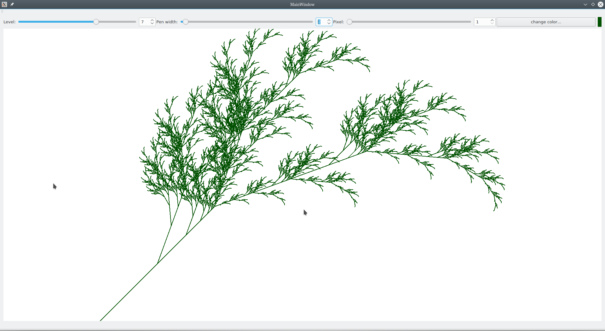
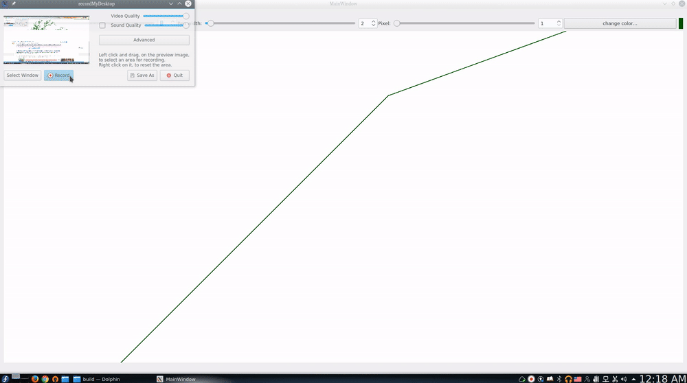

# FractalPlant
Creating a beautiful fractal using [L-system](https://en.wikipedia.org/wiki/L-system). For rendering I've used [Qt](https://www.qt.io/) framework. You can see the result in the following image:
  

  


For a higher resolution gif you can use [this](docs/FractalPlant.gif). I've used the following recurisve rules:
```
S → X
X → F[−X][X]F[−X]+FX
F → FF
```
`F` means "draw forward", `−` means "turn left 25 degree", and `+` means "turn right 25 degree". `X` does nothing during rendering. `[` means push the current position and angle into stack and `]` means to retreive the top value of stack (pop operation). in each level we use both rules `X → F[−X][X]F[−X]+FX` and `F → FF`. For example:
* level 0: `X`
* level 1: `FF[−X][X]FF[−X]+FFX`  

It is interesting this simple recursive formula can draw a beautiful tree!
## Requirements

1. C++
2. Qt >= 4.0.0
3. qmake

## Bulding the project

You can use Qt creator IDE to make the entire project or use a terminal. In Fedora 25 You need to use the following commands:

```
$ mkdir build
$ cd build
$ qmake-qt5 ..
$ make
$ ./FractalPlantApp
```
